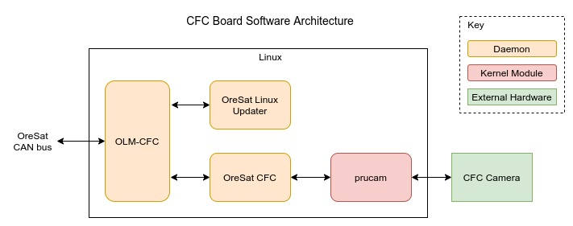

CFC (Cirrus Flux Camera)
========================

TBD

OLM-CFC
----------

.. note::

    Like all OreSat Linux boards, the CFC will have version of OLM on it.
    See the *General Design/software* for a quick overview or the
    `oresat-linux-manager`_ repo for more info.

OreSat Linux Updater
--------------------

.. note::

    Like all OreSat Linux boards, the CFC will have OreSat Linux Updater on
    it. See the *General Design/software* for a quick overview or the

OreSat CFC
----------

TBD

Repos: `oresat-cfc-software`_

PRUcam
------

A kernel module for interfacing to camera with with the PRUs on a Octavo A8.

Repo: `oresat-linux-prucam`_ 

CFC Camera
----------

TBD

.. _oresat-linux-manager: https://github.com/oresat/oresat-linux-manager
.. _oresat-linux-updater: https://github.com/oresat/oresat-linux-updater
.. _oresat-cfc-software: https://github.com/oresat/oresat-cfc-software
.. _oresat-linux-prucam: https://github.com/oresat/oresat-linux-prucam
