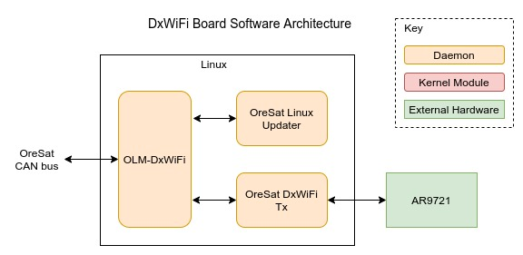

DxWiFi
======

A board with a camera and intenna for sending live video of Earth over long 
distance WiFi. This is apart of the OreSat Live payload mission.

OLM-DxWiFi
----------

.. note::

    Like all OreSat Linux boards, the DxWiFi will have version of OLM on it.
    See the *General Design/software* for a quick overview or the
    `oresat-linux-manager`_ repo for more info.

OreSat Linux Updater
--------------------

.. note::

    Like all OreSat Linux boards, the DxWiFi will have OreSat Linux Updater on
    it. See the *General Design/software* for a quick overview or the

OreSat DxWiFi Tx
----------------

TBD

Repos: `oresat-dxwifi-software`_  `oresat-live-software`_

AR9721
------

Atheros AR9271 Wireless Network Adapter.

TBD

.. _oresat-linux-manager: https://github.com/oresat/oresat-linux-manager
.. _oresat-linux-updater: https://github.com/oresat/oresat-linux-updater
.. _oresat-dxwifi-hardware: https://github.com/oresat/oresat-dxwifi-hardware
.. _oresat-dxwifi-software: https://github.com/oresat/oresat-dxwifi-software
.. _oresat-live-software: https://github.com/oresat/oresat-live-software
