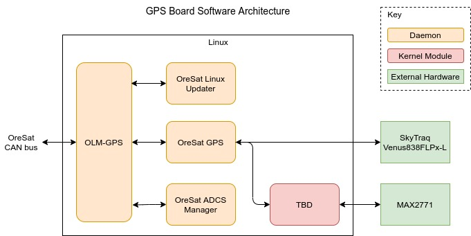

GPS
===

SDR/Hardware GPS receiver to calculate the location of satellite. Also will
include software for off loading the controls for ACS subsystem.

OLM-GPS
-------

.. note::

    Like all OreSat Linux boards, the GPS will have version of OLM on it. See
    the *General Design/software* for a quick overview or the
    `oresat-linux-manager`_ repo for more info.

Unlike other version of OLM, OLM-GPS will have the ability to send the Time Sync
PDO as it will have a very accurate local system time due to the time stamps in
the GPS data messages.

OreSat Linux Updater
--------------------

.. note::

    Like all OreSat Linux boards, the GPS will have OreSat Linux Updater on it.
    See the *General Design/software* for a quick overview or the
    `oresat-linux-updater`_ repo for more info.

OreSat GPS
----------

The GPS daemon. The orginial plan was to have a SDR GPS, but it was trim down
to be quick daemon in Python using a SkyTraq Venus838FLPx. When OreSat GPS gets
a lock on more than 4 GPS satellites, it will set the local system time to the
value in the GPS data message.

SDR part/version is TBD for now, but will be based off of `GNSS-SDR`_.

Repo: `oresat-gps-software`_

  
OreSat ADCS Manager
-------------------

The ADCS Manager daemon that controls the ADCS subsystem.

Repo:`oresat-adcs-software`_ 

MAX2771 Kernel Moduel
---------------------

TBD

SkyTraq Venus838FLPx-L
----------------------

A 50Hz -165dBm Low-Power GPS Module.

A fully hardware-based GPS that outputs NMEA messages or SkyTraq binary
messages over UART.

See the `Venus838FLPx`_ specifications for more info.

MAX2771
-------

A Multiband Universal GNSS Receiver.

Will be used by the SDR GPS.

See the `MAX2771`_ specifications for more info.

.. _oresat-linux-manager: https://github.com/oresat/oresat-linux-manager
.. _oresat-linux-updater: https://github.com/oresat/oresat-linux-updater
.. _oresat-gps-hardware: https://github.com/oresat/oresat-gps-hardware
.. _oresat-gps-software: https://github.com/oresat/oresat-gps-software
.. _oresat-adcs-software: https://github.com/oresat/oresat-adcs-software
.. _GNSS-SDR: https://gnss-sdr.org/
.. _Venus838FLPx: https://www.skytraq.com.tw/homesite/Venus838FLPx_PB_v1.pdf
.. _MAX2771: https://www.maximintegrated.com/en/products/comms/wireless-rf/MAX2771.html
