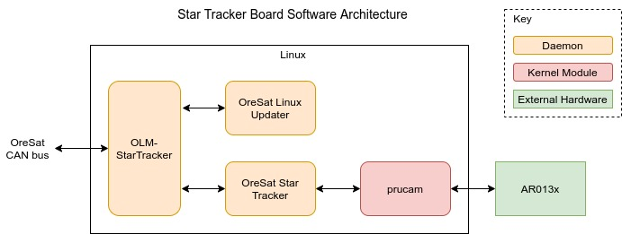

Star Tracker
============

Camera system that takes images of stars and uses the pattern of the stars let
to figure out which way the satellite is pointing.

OLM-StarTracker
---------------

.. note::

    Like all OreSat Linux boards, the Star Tracker will have version of OLM on
    it. See the *General Design/software* for a quick overview or the
    `oresat-linux-manager`_ repo for more info.

OreSat Linux Updater
--------------------

.. note::

    Like all OreSat Linux boards, the Star Tracker will have OreSat Linux
    Updater on it. See the *General Design/software* for a quick overview or
    the `oresat-linux-updater`_ repo for more info.

OreSat Star Tracker
-------------------

The Star Tracker daemon that uses computer vision and images of stars to figure
out which way the satellite is pointing by using the pattern of the stars in the
image.

Based off of `OpenStarTracker`_.

Repo: `oresat-star-tracker-software`_ 

PRUcam
------

A kernel module for interfacing to camera with with the PRUs on a Octavo A8.

Repo: `oresat-linux-prucam`_ 

AR013x
------

1/3-inch 1.2 Mp CMOS Digital Image Sensor.

See `AR0134CS`_ specifications sheet for more info.

.. _oresat-linux-manager: https://github.com/oresat/oresat-linux-manager
.. _oresat-linux-updater: https://github.com/oresat/oresat-linux-updater
.. _oresat-star-tracker: https://github.com/oresat/oresat-star-tracker
.. _oresat-star-tracker-software: https://github.com/oresat/oresat-star-tracker-software
.. _oresat-linux-prucam: https://github.com/oresat/oresat-linux-prucam

.. _AR0134CS: https://www.onsemi.com/pdf/datasheet/ar0134cs-d.pdf
.. _OpenStarTracker: http://openstartracker.org/
